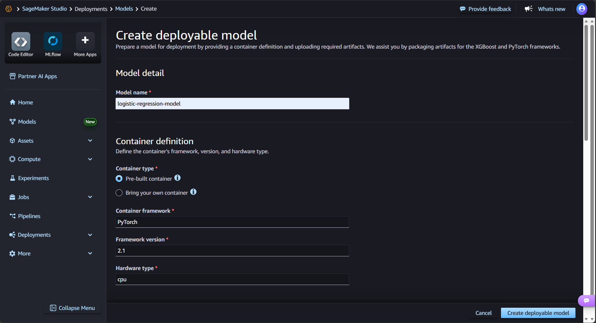
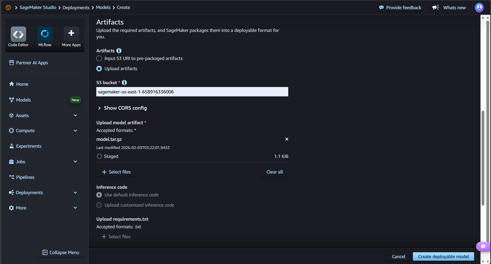
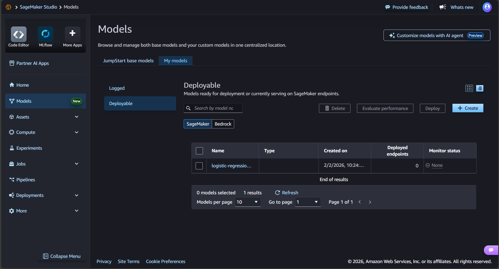
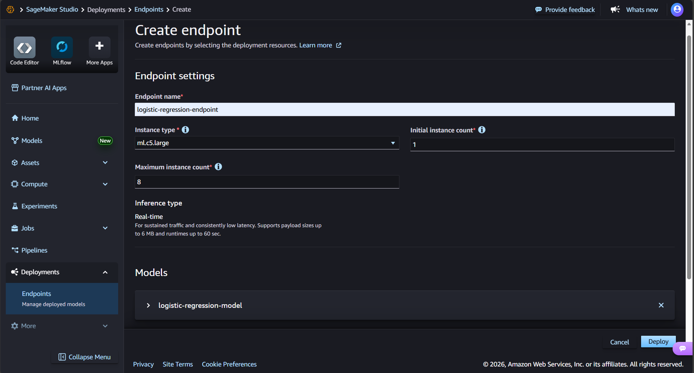
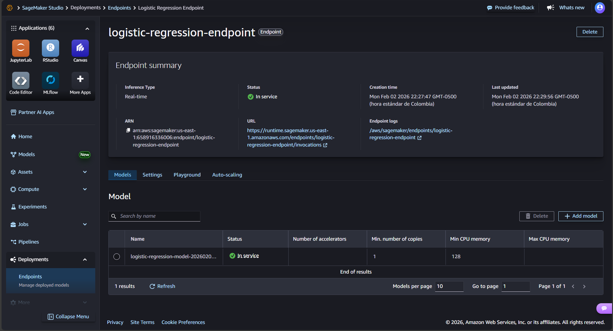
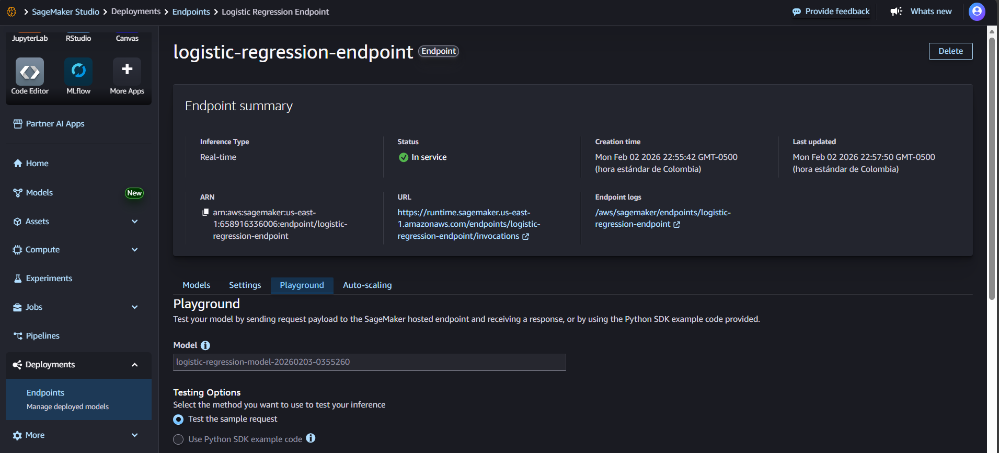
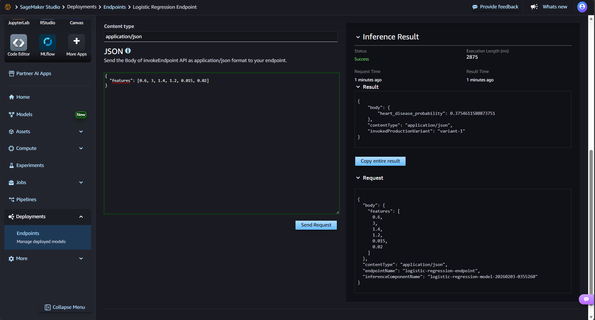

# Heart Disease Logistic Regression

## Overview
This project implements logistic regression from scratch to predict heart disease risk using the Kaggle Heart Disease dataset. The notebook covers data exploration, model training, decision boundary visualization, L2 regularization, and a deployment exploration in Amazon SageMaker.

## Exercise Summary
Implements logistic regression for heart disease prediction: EDA, training/visualization, regularization, and SageMaker deployment.

## Dataset Description
- Source: Kaggle Heart Disease dataset
- Download: https://www.kaggle.com/datasets/neurocipher/heartdisease
- Local file: `src/csv/Heart_Disease_Prediction.csv`
- Samples: 270
- Features: 14
- Target: `Heart Disease` (Presence / Absence)
- Presence rate: 44.4%
- Age range: 29–77 years
- Cholesterol range: 126–564 mg/dL

## Notebook Contents (heart_disease_lr_analysis.ipynb)
- Step 1: Data loading, binarization, EDA, train/test split, normalization, outlier check
- Step 2: Logistic regression from scratch (sigmoid, cost, gradients, GD)
- Step 3: Decision boundary visualizations (3 feature pairs)
- Step 4: L2 regularization (lambda tuning, metrics, cost curves)
- Step 5: SageMaker deployment exploration (steps + example test)

## Results (Summary)
- Model converges with α=0.01 and 1500+ iterations.
- Train/Test metrics are reported (Accuracy, Precision, Recall, F1).
- Regularization reduces ||w|| and can improve test F1 in some λ values.

## Exported Model Artifacts
From the notebook:
- `logreg_bias.npy`
- `logreg_weights.npy`

## SageMaker Deployment Evidence
Process summary:
- Trained model and exported `logreg_weights.npy` / `logreg_bias.npy`
- Created SageMaker notebook instance
- Deployed a real-time endpoint
- Tested inference with a sample input

### Screenshots

- Deployable model:







- Create and Deploy Endpoint:





- Testing Endpoint:





## Inference Script
A SageMaker-compatible inference file is included:
- `model/inference.py`

Expected JSON input:
```json
{
    "features": [0.6, 3, 1.4, 1.2, 0.015, 0.02]
}
```
Expected JSON output:
```json
{
    "body": {
        "heart_disease_probability": 0.3754611580873751
    },
    "contentType": "application/json",
    "invokedProductionVariant": "variant-1"
}
```

## Project Structure

- heart_disease_lr_analysis.ipynb: main notebook

- Heart_Disease_Prediction.csv: dataset

- inference.py: deployment inference handler

- src/img: SageMaker screenshots

- README.md: documentation

## How to Run (Local)

- Open heart_disease_lr_analysis.ipynb

- Run all cells in order

- Review plots, metrics, and model outputs
